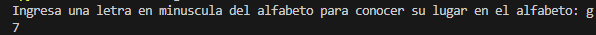
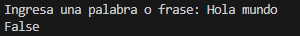
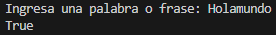

# Funciones Index y Isalnum
## Miguel Galindo
### La funcion Index sirve para indicar en que posicion se encuentra un caracter o palabra contando desde cero hasta el numero de caracteres que tenga un mensaje, por ejemplo en el algoritmo si introducimos una letra, nos devuelve la posicion que ocupa en el alfabeto (o texto que nosotros mismos hayamos escogido), tambien si el caracter al que buscamos su posicion no se encuentra, el programa lanza un error.

### La funcion Isalnum sirve para verificar o comprobar si en una cadena de texto esta compuesta de numeros o letras (o ambas), esta funcion devuelve un Booleano (True o False),si en el string hay espacios o caracteres especiales como ",", devuelve un false, pero si solo tiene numeros y/o letras devuelve un true.

